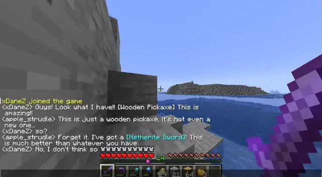

# LookWhatIHave

Display your items in chat

### usage

Simply use a keyword of your choosing in the chat message and hold the item in your main hand

### commands 💬

- **/lwih** show plugin info
- **/lwih reload** reload config

### permissions 🔑

- lookwhatihave.reload: reload command
- lookwhatihave.display.item: display items in chat; only required when 'requires-permission' in config is set to true

### compatibility 🧩

plugin version: **1.0** 
Paper: **1.17 - 1.21.11**